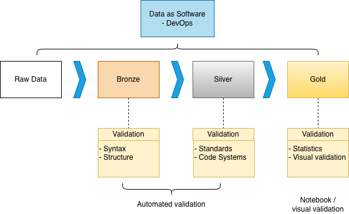

# Finnish Health Data Hackathon

[Invinite Oy](https://www.invinite.fi/) participated to the [Finnish Health Data Hackathon](https://fhir.fi/hackathon/2026/finland) on January 2026. We explored how data-as-software methodology can be used for improving completeness and correctness of synthetic data. This project contains an ETL pipeline implemented with modern python based stack (`uv`, `polars`, `duckdb`, and `marimo`) that perfoms simple data validations. In addition, we demonstrate how non-obvious higher aggregation level properties of the data such as distributions can be tested and visualized from aggregated synthetic data.

## High level structure

- Synthetic [SYNDERAI](https://synderai.net/) data FHIR Bundle JSON files are read from `data/EPS`
- Nested JSON data is flattened and stored to duckdb tables. New table is created per each resource type
- Data layout follows the widely adopted medallion-pattern:
  - Bronze layer contains data with minimal changes
  - Silver layer contains a cleaned up version from the bronze layer data where nested fields are flattened and validations are performed for values
  - Gold layer contains polished "data products". In our application, these tables contain aggregated distributions from data, that can be visualized and tested to ensure that synthetic data follow forms realistic distributions
- A marimo notebook ties everything together. It allows users to explore data in bronze, silver and gold layers through table UI and visualisations.
  - Static export of the notebook is available as [interactive notebook demo](https://inviniteopen.github.io/invinite.github.io/). Clone the repository for running interactive notebooks

## Why this matters?

High quality synthetic data offers solid foundation for developing health related applications. Lack of realistic data is common pain point faced by product development teams.

In addition, testing the aggregated properties of synthetic data becomes important when testing following aspects of a software system:

- AI applications that summarize data: if the test data distribution is not representative enough, it is impossible to test insights generated by AI system.
- Performance: distribution of data can have significant effects to the performance of a health data system depending of various factors like what data storage is used, how data is partitioned and what are the typical access patterns to data. Without representative data, the real life performance characteristics can not be tested.

## Data as Software (DAS)

The `das/` module provides typed dataframe abstractions for working with any source data. It enables type-safe dataframe operations across multiple engines. Following Medallion architecture we can process the data in steps and do different type of validation on each level. See the [interactive notebook demo](https://inviniteopen.github.io/invinite.github.io/) for an example of gold-level visual validation.

**Storage policy:** Only raw data (bronze) and reporting data (gold) are persisted to the database. Silver layer runs in-memory to avoid exposing intermediate structures and to allow refactoring without migrations. Use `--debug` flag to persist silver tables for debugging.



### Currently Supported engines

- **DuckDB** - Fast analytical queries on local data
- **Polars** - High-performance dataframe library
- **Spark** - Distributed processing

However, Spark is **not included in the main engine directory** for this project for keeping the scope in check (JVM dependency).

### Purpose

DAS allows you to:

- Load parsed FHIR resources into typed dataframes
- Perform type-safe transformations and analysis
- Use consistent APIs across different dataframe engines

### Improving test data quality with Data-as-Software

One of the main benefits of the Data-as-Software (DAS) paradigm is higher-quality test data. When test data curation, normalization, and validation are expressed as code, you can apply the same rigor that software teams already use for correctness and maintainability.

Key advantages:

- **Runs anywhere**: the logic is just Python, so the same test-data pipeline can run in public cloud, private cloud, or on-prem (including developer laptops and CI).
- **First-class testing**: use `pytest` to unit test transformations, validate invariants, and lock in expected behavior as the data and schemas evolve.
- **Modern developer tooling**: linters, formatters, type checkers, and language servers (autocomplete, go-to-definition, refactors) work out of the box, making it easier to evolve data logic safely.
- **Versioned, reviewable changes**: treat test datasets and their generators like software artifacts—code review, diffs, and reproducible builds reduce “mysterious” changes.
- **Composable and reusable**: small, well-tested transformation functions can be reused across pipelines and test suites instead of being re-implemented in multiple places.

This complements (rather than replaces) the traditional SQL-centric approach. SQL is excellent for expressing set-based analytics and is widely understood, but data workflows implemented primarily as SQL can face challenges like:

- **Logic spread across many queries** (and sometimes multiple systems), which can make it harder to modularize and reuse.
- **Testing and refactoring friction**, especially when “business rules” are encoded in long queries without the same unit-testing ergonomics.
- **Limited IDE-aware tooling** compared to general-purpose programming languages (static typing, richer refactors, tighter integration with test runners).

With DAS, you can still use SQL where it shines (for example, via DuckDB), but put the workflow under software engineering discipline: typed models (`fhir.resources`), explicit validation, and a test suite that continuously guards test data quality.

## Requirements

- Use `uv` for environment and dependencies.

## Quick start

Create duckdb database from JSON files with

```bash
uv run main.py
```

Open marimo-powered data exploration and visualization notebook

```
uv run --group notebook marimo edit src/marimo/explore_fhir_duckdb.py
```

Run tests

```
uv run pytest
```

## Code quality

Format:

```bash
uvx ruff format .
```

Lint:

```bash
uvx ruff check .
```

Type check:

```bash
uvx ty check .
```
