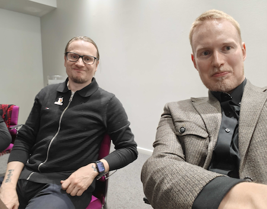

# Invinite at the Finnish Health Data Hackathon: Data as Software in Practice

_January 19, 2026_

Last weekend, [Invinite](https://www.invinite.fi/) participated in the [Finnish Health Data Hackathon](https://fhir.fi/hackathon/2026/finland). We joined the [Care Plans track focused on testing](https://fhir.fi/hackathon/2026/finland/care-plans#testing), where we explored whether a **Data as Software (DAS)** approach could be used for testing and validating synthetic FHIR data—both structurally and in terms of how realistic the data is.

The core idea behind DAS is simple: data engineering doesn't have to be different from software engineering. The same practices that make code maintainable: types, tests, code review, CI/CD—apply directly to data transformations. It's not about replacing SQL or abandoning existing tools, but about wrapping data work in the engineering discipline that software teams take for granted.


_Eetu Sutinen and Tommi Summanen representing Invinite at the hackathon_

## Why Synthetic Data Quality Matters

1. **AI applications need representative distributions** - if test data doesn't reflect reality, you can't validate AI-generated insights
2. **Performance testing requires realistic patterns** - data distribution affects query performance, partitioning strategies, and access patterns
3. **Compliance testing needs edge cases** - synthetic data must include the boundary conditions that trigger validation logic

## Architecture: The Medallion Pattern

We follow the medallion architecture (bronze → silver → gold), but with an important design decision: **only bronze and gold persist to disk**.


Silver runs in-memory because:

- **Refactoring without migrations** - intermediate schemas probably change during development
- **No intermediate data exposure** - only raw and final outputs are visible
- **Simpler debugging** - persist silver tables only when needed

## Code-First Data Quality

The core innovation is expressing data validation as typed Python code. We define typed models that aren't just documentation—they're enforced at runtime:

```python
class Observation(TypedLazyFrame):
    """Observation model - domain-modeled from FHIR Observation."""

    id: Col[str]
    status: Col[str]
    subject_id: Col[str]
    value_quantity_value: Col[float]
    validation_errors: Col[list[str]]
```

Validation rules are declarative. Failed validations don't drop rows—they populate a `validation_errors` column, preserving data lineage and enabling aggregate quality reporting.

## Testing Transformations Like Software

With transformations expressed as functions, we can test them with pytest like any other code. Tests execute in milliseconds because Polars lazy evaluation only materializes data when needed.

This means:

- **Code review catches logic errors** - validation rules are reviewable Python, not buried in SQL
- **CI/CD validates changes** - automated checks run on every commit
- **Refactoring is safe** - type checkers and tests catch regressions

## Visual Validation

For properties that are hard to express as unit tests—like distribution shapes—we use marimo notebooks. The gold layer aggregates data into metrics that can be visualized. A static export is available at our [notebook demo](https://inviniteopen.github.io/invinite.github.io/).

## Why This Matters for Healthcare

Healthcare software development faces a data paradox: you need realistic test data to build quality software, but real patient data requires strict access controls. Synthetic data bridges this gap, but only if it's actually representative.

DAS methodology provides:

1. **Auditable quality** - every validation rule is version-controlled and testable
2. **Reproducible pipelines** - same code runs anywhere (laptop, CI, cloud)
3. **Iterative improvement** - fix a validation gap, add a test, ship confidently

## Explore the Code

The full source is available on GitHub: [inviniteopen/fhir-hackathon](https://github.com/inviniteopen/fhir-hackathon)

The stack includes uv, Polars, DuckDB, marimo, and pytest—all chosen for developer experience and performance.

## Conclusion

The hackathon gave us a focused opportunity to demonstrate that data engineering doesn't have to be different from software engineering. The same practices that make code maintainable—types, tests, code review, CI/CD—apply directly to data transformations.

Data as Software isn't about replacing SQL or abandoning existing tools. It's about wrapping data work in the engineering discipline that software teams take for granted.

---

_We're always interested in discussing Data as Software approaches. [Let's talk](https://www.invinite.fi/contact)._
